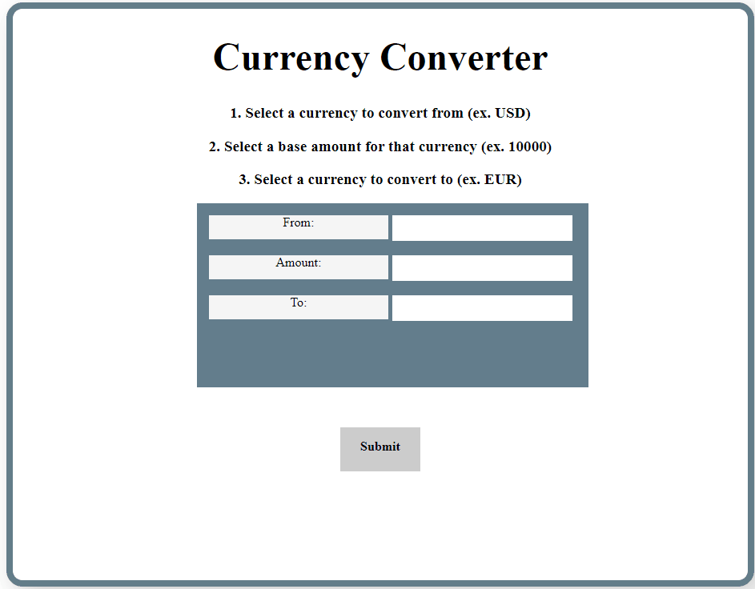

# currency_converter
Simple API endpoint for converting currencies, built in node.js

The web app allows users to convert nominal amounts between currencies. Simply fill out the form with the desired currencies and amount and initiate a GET request. API can also be queried programatically by using the '/currencies' endpoint with the appropriate parameters. The response is printed out to an HTML element for visibility.

At time of writing, app is available at [rolandli.rocks](http://rolandli.rocks)
